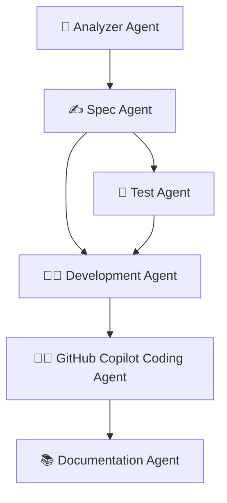
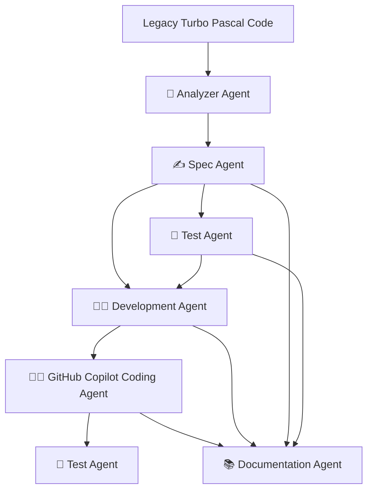

# 🧠 Agent-Based Spec-Driven Development Flow

This model uses five specialized agents to manage the migration of a legacy Turbo Pascal application to Java. Each agent owns a distinct phase and collaborates through structured handoffs and shared artifacts.

## 📌 Agent Collaboration Flow



## Handoff Points and Artifacts

| Agent | Receives From | Produces | Hands Off To | Communication Format |
|-------|---------------|----------|--------------|---------------------|
| 🧠 Analyzer Agent | Raw Pascal code | analysis.md, code-structure.mmd | ✍️ Spec Agent | Markdown, Mermaid |
| ✍️ Spec Agent | Analyzer Agent | user-stories.md, architecture.md, architecture.mmd | 🧪 Test Agent, 🧑‍💻 Development Agent | Markdown |
| 🧪 Test Agent | Spec Agent | testplan.md, performance-baseline.md, test-data.json | 🧑‍💻 Development Agent | Markdown |
| 🧑‍💻 Development Agent | Spec Agent, Test Agent | development-plan.md, GitHub Issues & Epics | 📚 Documentation Agent, 👨‍💻 GitHub Copilot Coding Agent | Markdown, GitHub |
| 📚 Documentation Agent | All agents | mapping.md, changelog.md, migration-flow.mmd | Everyone | Markdown |
| 👨‍💻 GitHub Copilot Coding Agent | Development Agent | Java code, PRs, commits | 🧪 Test Agent, 📚 Documentation Agent | GitHub Issues & PRs |

## Migration Flow



## 📋 Example Prompts

Simple prompts for each agent chatmode to execute the migration workflow. Each file has YAML front matter with the mode and a minimal prompt.

| File | Mode | Purpose |
|------|------|---------|
| [`01-analyzer-agent-prompt.md`](example-prompts/01-analyzer-agent-prompt.md) | `analyzer-agent` | Analyze Pascal code |
| [`02-spec-agent-prompt.md`](example-prompts/02-spec-agent-prompt.md) | `spec-agent` | Create Java specifications |
| [`03-test-agent-prompt.md`](example-prompts/03-test-agent-prompt.md) | `test-agent` | Design test strategy |
| [`04-development-agent-prompt.md`](example-prompts/04-development-agent-prompt.md) | `development-agent` | Create development plan |
| [`05-documentation-agent-prompt.md`](example-prompts/05-documentation-agent-prompt.md) | `documentation-agent` | Create migration docs |

### 🎯 Usage
Copy the entire content from each prompt file - the YAML front matter defines the chatmode, and each agent knows its responsibilities from the mode definition.

### 🚀 Execution Workflow
Execute sequentially for optimal results:

1. **Analyzer Agent** → Analyzes Pascal code structure and logic
2. **Spec Agent** → Creates Java specifications and architecture  
3. **Test Agent** → Designs comprehensive test strategy
4. **Development Agent** → Creates development plan and GitHub issues
5. **Documentation Agent** → Maintains migration traceability
6. **GitHub Copilot** → Implements the Java solution

## 📁 Expected Artifacts

Following this workflow will produce:

```
specs/
├── docs/
│   ├── analysis.md                 # Pascal code analysis
│   ├── user-stories.md            # Functional requirements
│   ├── architecture.md            # Java design specifications
│   ├── performance-baseline.md    # Performance requirements
│   ├── mapping.md                 # Pascal→Java translation guide
│   └── changelog.md               # Migration timeline
├── diagrams/
│   ├── code-structure.mmd         # Pascal code structure
│   └── architecture.mmd           # Java architecture
├── plans/
│   ├── testplan.md                # Testing strategy
│   └── development-plan.md        # Implementation roadmap
└── tests/
    └── test-data.json             # Test scenarios and data
```

## 🎨 Customization

To adapt this workflow for your own Pascal projects:

1. **Replace file paths**: Update `/legacy/source/` with your Pascal file locations
2. **Adjust scope**: Modify analysis focus based on code complexity
3. **Update requirements**: Customize functional and non-functional requirements
4. **Adapt architecture**: Adjust Java architecture for your application needs
5. **Modify test strategy**: Update testing approach for your validation requirements

## 💡 Best Practices

- **Sequential Execution**: Follow the numbered order for optimal results
- **Iterative Refinement**: Use agent outputs to refine subsequent prompts
- **Cross-Reference**: Each agent should review outputs from previous agents
- **Validation**: Ensure each output meets acceptance criteria before proceeding
- **Documentation**: Keep all artifacts for traceability and future reference

## 🔄 Agent Collaboration Details

The workflow creates seamless handoffs between agents, with each building upon previous work to create a comprehensive migration pipeline from legacy Pascal to modern Java.
