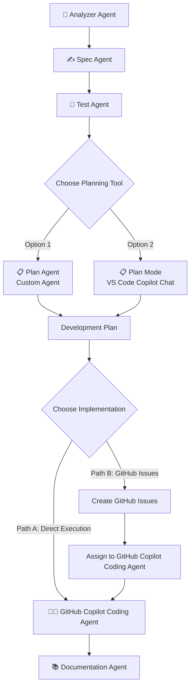

# 🧠 Agent-Based Spec-Driven Development Flow

This model uses five specialized agents to manage the migration of a legacy Turbo Pascal application to Java. Each agent owns a distinct phase and collaborates through structured handoffs and shared artifacts.

## 📌 Agent Collaboration Flow


```mermaid
flowchart TD
    A[🧠 Analyzer Agent] --> B[✍️ Spec Agent]
    B --> C[🧪 Test Agent]
    C --> CHOICE{Choose Planning Tool}
    CHOICE -->|Option 1| D[📋 Plan Agent<br/>Custom Agent]
    CHOICE -->|Option 2| G[📋 Plan Mode<br/>VS Code Copilot Chat]
    D --> PLAN[Development Plan]
    G --> PLAN
    PLAN --> IMPL{Choose Implementation}
    IMPL -->|Path A: Direct Execution| F[👨‍💻 GitHub Copilot Coding Agent]
    IMPL -->|Path B: GitHub Issues| H[Create GitHub Issues]
    H --> I[Assign to GitHub Copilot Coding Agent]
    I --> F
    F --> E[📚 Documentation Agent]
```

## Handoff Points and Artifacts

| Agent | Receives From | Produces | Hands Off To | Communication Format |
|-------|---------------|----------|--------------|---------------------|
| 🧠 Analyzer Agent | Raw Pascal code | analysis.md, code-structure.mmd | ✍️ Spec Agent | Markdown, Mermaid |
| ✍️ Spec Agent | Analyzer Agent | user-stories.md, architecture.md, architecture.mmd | 🧪 Test Agent | Markdown |
| 🧪 Test Agent | Spec Agent | testplan.md, performance-baseline.md, test-data.json | **Choice:** Plan Agent OR Plan Mode | Markdown |
| 📋 Plan Agent (Option 1) | Test Agent | development-plan.md | **Choice:** Direct Execution OR GitHub Issues | Markdown |
| 📋 Plan Mode (Option 2) | Test Agent | development-plan.md | **Choice:** Direct Execution OR GitHub Issues | Markdown |
| 👨‍💻 GitHub Copilot Coding Agent | Development Plan (Path A: Direct) OR GitHub Issues (Path B) | Java code, PRs, commits | 📚 Documentation Agent | Code, GitHub PRs |
| 📚 Documentation Agent | All agents | mapping.md, changelog.md | Everyone | Markdown |

## 📋 Example Prompts

Simple prompts for each agent chatmode to execute the migration workflow. Each file has YAML front matter with the mode and a minimal prompt.

| File | Agent/Mode | Purpose |
|------|------------|---------|  
| [`01-analyzer-agent.prompt.md`](../.github/prompts/01-analyzer-agent.prompt.md) | `analyzer-agent` | Analyze Pascal code |
| [`02-spec-agent.prompt.md`](../.github/prompts/02-spec-agent.prompt.md) | `spec-agent` | Create Java specifications |
| [`03-test-agent.prompt.md`](../.github/prompts/03-test-agent.prompt.md) | `test-agent` | Design test strategy |
| [`04-01-plan-mode.prompt.md`](../.github/prompts/04-01-plan-mode.prompt.md) | `Plan Mode` | **Option 1:** Create development plan (VS Code Copilot Chat) |
| [`04-02-plan-agent.prompt.md`](../.github/prompts/04-02-plan-agent.prompt.md) | `plan-agent` | **Option 2:** Create development plan (Custom Agent) |
| [`05-01-agent-mode.prompt.md`](../.github/prompts/05-01-agent-mode.prompt.md) | `#github-pull-request_copilot-coding-agent` | **Path A:** Direct execution by Coding Agent |
| [`05-02-contributor-agent.prompt.md`](../.github/prompts/05-02-contributor-agent.prompt.md) | GitHub Issues | **Path B:** Create GitHub Issues, assign to Coding Agent |
| [`06-documentation-agent.prompt.md`](../.github/prompts/06-documentation-agent.prompt.md) | `documentation-agent` | Create migration docs |

**Planning Tool Choice (After Test Agent):**
- **Option 1 - Plan Agent**: Use custom `plan-agent` to create development plan
- **Option 2 - Plan Mode**: Use VS Code Copilot Chat Plan Mode to create development plan

**Implementation Path Choice (After Plan Creation):**
- **Path A - Direct Execution**: Hand off plan directly to GitHub Copilot Coding Agent for immediate implementation
- **Path B - GitHub Issues**: Create GitHub Issues from plan first for traceability, then assign to GitHub Copilot Coding Agent

### 🚀 Execution Workflow
Execute sequentially for optimal results:

1. **Analyzer Agent** → Analyzes Pascal code structure and logic
2. **Spec Agent** → Creates Java specifications and architecture  
3. **Test Agent** → Designs comprehensive test strategy
4. **Choose your planning tool:**
   - **Option 1 - Plan Agent**: Use custom agent to create development plan
   - **Option 2 - Plan Mode**: Use VS Code Copilot Chat Plan Mode to create development plan
5. **Choose your implementation path:**
   - **Path A - Direct Execution**: 
     - **GitHub Copilot Coding Agent** → Executes implementation directly from plan
   - **Path B - GitHub Issues**:
     - Create GitHub Issues from plan for traceability
     - **Assign to GitHub Copilot Coding Agent** → Implements from assigned Issues
6. **Documentation Agent** → Maintains migration traceability

## 📁 Expected Artifacts

Following this workflow will produce:

```
specs/
├── docs/
│   ├── analysis.md                 # Pascal code analysis
│   ├── user-stories.md            # Functional requirements
│   ├── architecture.md            # Java design specifications
│   ├── performance-baseline.md    # Performance requirements
│   ├── mapping.md                 # Pascal→Java translation guide
│   └── changelog.md               # Migration timeline
├── diagrams/
│   ├── code-structure.mmd         # Pascal code structure
│   └── architecture.mmd           # Java architecture
├── plans/
│   ├── testplan.md                # Testing strategy
│   └── development-plan.md        # Implementation roadmap
└── tests/
    └── test-data.json             # Test scenarios and data
```

## 🎨 Customization

To adapt this workflow for your own Pascal projects:

1. **Replace file paths**: Update `/legacy/source/` with your Pascal file locations
2. **Adjust scope**: Modify analysis focus based on code complexity
3. **Update requirements**: Customize functional and non-functional requirements
4. **Adapt architecture**: Adjust Java architecture for your application needs
5. **Modify test strategy**: Update testing approach for your validation requirements

## 💡 Best Practices

- **Sequential Execution**: Follow the numbered order for optimal results
- **Iterative Refinement**: Use agent outputs to refine subsequent prompts
- **Cross-Reference**: Each agent should review outputs from previous agents
- **Validation**: Ensure each output meets acceptance criteria before proceeding
- **Documentation**: Keep all artifacts for traceability and future reference

## 🔄 Agent Collaboration Details

The workflow creates seamless handoffs between agents, with each building upon previous work to create a comprehensive migration pipeline from legacy Pascal to modern Java.
